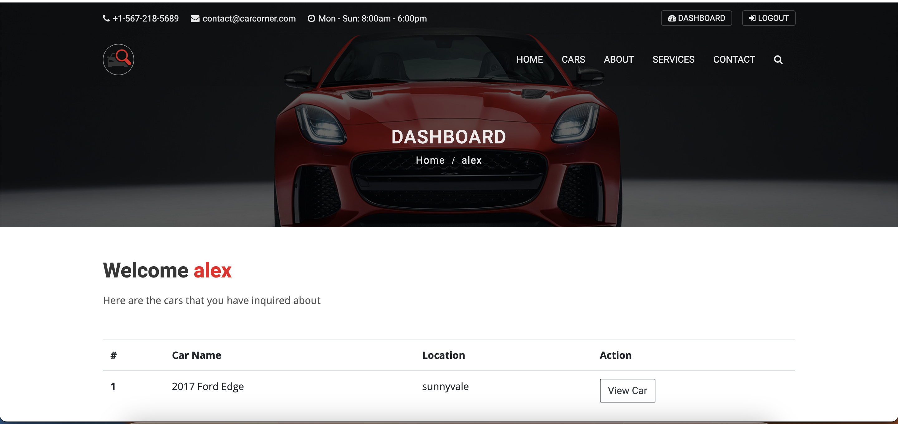

# CMPE 282 Project of Group Cloud Bloom
<b>Course Name :</b> Cloud Services

<b>Project Name  :</b> Carcorner

<b>Application URL :</b> 

<b>University Name :</b> [San Jose State University](https://www.sjsu.edu/)


<b>Professor's Name :</b> Andrew Bond

<b>Team Name:</b> Cloud Bloom

<b>Team Members:</b> <br/>
[Bhavya Hegde](www.linkedin.com/in/bhavya-hegde-145b9b123)<br/>
[Darshini Venkatesha Murthy Nag](https://www.linkedin.com/in/darshini-venkatesha-murthy-nag-90052756/)<br/>
[Sirisha Polisetty](https://www.linkedin.com/in/sirishapolisetty/)<br/>
[Blessy Dickson Daniel Moses](https://www.linkedin.com/in/blessy-dickson-348a31133/) 


## Introduction
Car Corner is a website that will facilitate the sale of second-hand cars by allowing dealers to list the cars available for sale, along with details such as the selling price, location, and vehicle services offered. The website will have two interfaces, one for customers and another for admins. Customers will be able to browse and filter car listings based on various criteria and make enquiries about listings. The website is hosted on cloud to ensure high security through the use of SSL/TLS certificates.


## Carcorner Application Features
* View the latest and featured cars
* View cars in detail with all features, model,etc
* Advanced search by year,model,state or city listed in
* Register and login using Google SSO eliminating the creation of redundant accounts 
* Registered users can send multiple inquiries about cars they are interested in
* Registered users can view a customized dashboard
* SSL certificates are installed for security
* CI/CD using Jenkins


## Carcorner Admin Features
* List cars based on color, model, year, price, description, and the city where it is available and by the condition(Eg. if it is used)
* View enquiries from the users
* Add, update or delete users and team members
* Generate description for cars using chatgpt integration

## Additional Application Features
* Dashboard View - Users can view their all their current and previous inquires.
* Responsive UI.


## Tools and Technologies used
Frontend: HTML, CSS, Bootstrap, Javascript<br/>
Backend: Python Django framework<br/>
Other tools: Visual studio code, PyCharm,GitHub actions for CI/CD,Docker<br/>
AWS components: EC2, Route 53, ELB, RDS postgreSQL, s3, certificate manager
Third party technologies:Open AI API
  
## Architecture Diagram


#### CI/CD Pipeline
* GitHub workflows, Amazon S3, Ubuntu crontab, and Docker for CI/CD of this project.

## Instructions to run project locally
#### Create a virtual environment
```
python -m venv venv
  ```
#### Activate the virtual environment

* macOS:
```
source venv/bin/activate
```

* Windows:
```

venv\scripts\activate
```

#### Install required dependencies
```
pip install -r requirements.txt
```
#### Set up environment variables
```
touch .env
```
#### We need to add below details in env
```
SECRET_KEY=
DEBUG=True
EMAIL_HOST=smtp.gmail.com
EMAIL_PORT=
EMAIL_HOST_USER=
EMAIL_HOST_PASSWORD=
EMAIL_USE_TLS=True
OPENAPI_TOKEN=
```

#### Run migrations
```
python manage.py makemigrations
python manage.py migrate
```

#### Create an admin user to access the Django Admin interface
```
python manage.py createsuperuser
```

#### Run the application
```
python manage.py runserver
```
## Sample Demo screenshots
Home page:


Login page:


User Dashboard page:


Featured cars page:


Car details page:


Inquiry page:


## References

Icons - https://flaticon.com <br/>

Car Descriptions - https://www.wikipedia.com <br/>

Car Images Sources <br/>
https://www.redbook.com.au/ <br/>
https://www.truecar.com/ <br/>
https://www.carmax.com/ <br/>
https://ar.pinterest.com/ <br/>
https://www.brandonford.com/ <br/>
https://www.carid.com/ <br/>
https://www.seldenmotors.com/ <br/>

